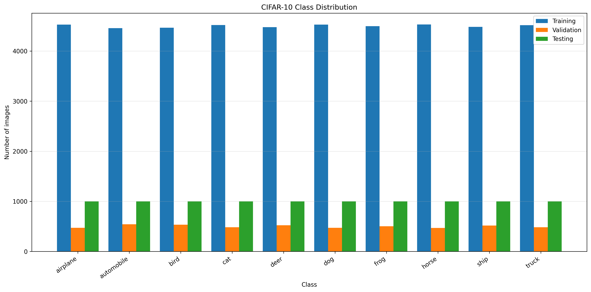

# CNN for CIFAR-10 Image Classification using Deep Learning   


## Overview

This project implements a complete **Convolutional Neural Network (CNN)** pipeline for image classification using the **CIFAR-10** dataset. The system is built using **TensorFlow/Keras** and demonstrates the complete deep learning workflow, including data preprocessing, augmentation, CNN model development, transfer learning, model evaluation, visualization, and performance analysis.

The project includes multiple CNN architectures, advanced training strategies, Grad-CAM visualization, ensemble prediction, and automated report generation.

---

# Objectives

- Load and preprocess the CIFAR-10 dataset.
- Explore class distribution and pixel statistics.
- Apply data augmentation to improve generalization.
- Build and train a baseline CNN.
- Develop an advanced Residual CNN.
- Perform transfer learning using MobileNetV2.
- Evaluate models using multiple performance metrics.
- Visualize learned filters, feature maps, Grad-CAM heatmaps, and confusion matrices.
- Compare multiple deep learning models.
- Generate prediction files, reports, and visualizations automatically.

---

# Dataset

Dataset Used

```
CIFAR-10
```

The dataset contains:

- 60,000 RGB images
- Image size: 32 × 32 pixels
- 10 object categories
- 50,000 training images
- 10,000 testing images

Classes include:

- Airplane
- Automobile
- Bird
- Cat
- Deer
- Dog
- Frog
- Horse
- Ship
- Truck

---

# Project Structure

```text
CNN for Image Classification
│
├── cnn_image_classification_corrected.py
│
├── outputs
│   ├── history
│   ├── logs
│   ├── models
│   ├── plots
│   ├── predictions
│   └── reports
│
└── README.md
```

---


# Technologies Used

- Python
- TensorFlow
- Keras
- NumPy
- Pandas
- Matplotlib
- Scikit-Learn

---

# Features

## Data Exploration

- Class balance visualization
- Pixel distribution analysis
- Sample image visualization
- Data statistics generation

---

## Data Preprocessing

- Pixel normalization
- One-hot encoding
- TensorFlow Dataset pipeline
- Batch loading
- Prefetch optimization

---

## Data Augmentation

The project performs real-time augmentation including:

- Random horizontal flipping
- Random rotation
- Random translation
- Random contrast adjustment

---

# CNN Architectures

## Baseline CNN

Architecture

```text
Input
↓

Conv2D (32)

↓

ReLU

↓

MaxPooling

↓

Conv2D (64)

↓

ReLU

↓

MaxPooling

↓

Flatten

↓

Dense (128)

↓

Dropout (0.5)

↓

Softmax Output
```

---

## Advanced CNN

The advanced architecture includes:

- Residual Blocks
- Batch Normalization
- Dropout
- L2 Regularization
- Global Average Pooling
- Dense Classifier

---

## Transfer Learning

Uses:

- MobileNetV2
- ImageNet pretrained weights
- Frozen convolutional backbone
- Fine-tunable classifier

---

# Training Configuration

| Parameter | Value |
|-----------|-------|
| Batch Size | 64 |
| Optimizer | Adam |
| Initial Learning Rate | 0.001 |
| Loss Function | Categorical Crossentropy |
| Early Stopping | Enabled |
| Reduce LR on Plateau | Enabled |
| Model Checkpoint | Enabled |
| L2 Regularization | 1e-4 |

---

# Model Evaluation

The project evaluates models using:

- Test Accuracy
- Precision
- Recall
- F1 Score
- Per-Class Accuracy
- Confusion Matrix
- Error Analysis

---

# Visualizations Generated

The project automatically generates:

- Sample Images
- Class Balance Graph
- Pixel Distribution
- Data Augmentation Samples
- Training Accuracy Curve
- Validation Accuracy Curve
- Training Loss Curve
- Validation Loss Curve
- Confusion Matrix
- Normalized Confusion Matrix
- Per-Class Accuracy
- Feature Maps
- Learned Filters
- Grad-CAM Heatmaps
- Misclassified Images
- Error Analysis
- Model Comparison Graph

---

# Generated Files

## Models

```
Baseline CNN
Advanced Residual CNN
MobileNetV2 Transfer Learning
```

Saved as

```
.keras
.h5
```

---

## Training History

- CSV
- JSON

---

## Prediction Files

Generated as CSV containing:

- Image Index
- True Label
- Predicted Label
- Confidence Score
- Prediction Probabilities

---

## Reports

Automatically generated:

- Classification Report
- Metrics JSON
- Confusion Matrix CSV
- Error Analysis
- Per-Class Accuracy
- Complete Results JSON
- Performance Report

---

# Training Pipeline

```text
Load Dataset
      │
      ▼
Data Exploration
      │
      ▼
Data Preprocessing
      │
      ▼
Data Augmentation
      │
      ▼
Baseline CNN
      │
      ▼
Advanced CNN
      │
      ▼
Transfer Learning
      │
      ▼
Evaluation
      │
      ▼
Visualization
      │
      ▼
Prediction
      │
      ▼
Performance Report
```

---

# Performance Metrics

The project reports:

- Training Accuracy
- Validation Accuracy
- Test Accuracy
- Precision
- Recall
- F1 Score
- Per-Class Accuracy
- Error Analysis

---

# Output Directory

```text
outputs/

├── models
├── plots
├── history
├── reports
├── predictions
└── logs
```

---

# Installation

Clone the repository

```bash
git clone <repository-url>
```

Install dependencies

```bash
pip install tensorflow
pip install numpy
pip install pandas
pip install matplotlib
pip install scikit-learn
pip install h5py
pip install pydot
```

(Optional)

Install Graphviz for architecture visualization.

---

# Run the Project

```bash
python cnn_image_classification_corrected.py
```

---

# Expected Outputs

The project automatically generates:

- Trained CNN models
- Training history
- Evaluation metrics
- Prediction CSV files
- Confusion matrices
- Per-class accuracy charts
- Feature map visualizations
- Learned filter visualizations
- Grad-CAM heatmaps
- Misclassified image grids
- Error analysis reports
- Model comparison charts
- Complete performance report

---

# Future Improvements

Possible extensions include:

- EfficientNet implementation
- Vision Transformer (ViT)
- DenseNet architecture
- Xception model
- MixUp augmentation
- CutMix augmentation
- Label smoothing
- Hyperparameter optimization
- Streamlit deployment
- Gradio deployment

---

# Conclusion

This project demonstrates a complete end-to-end deep learning workflow for image classification using the CIFAR-10 dataset. It covers dataset exploration, preprocessing, CNN architecture design, transfer learning, advanced visualization techniques, comprehensive model evaluation, and automated reporting. The implementation provides a strong foundation for understanding modern convolutional neural networks while producing reproducible results suitable for academic learning and experimentation.
